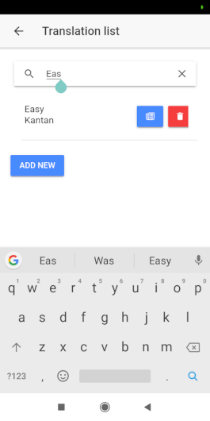

## Kantan Japanese

An Ionic 3 app to aid in Japanese studies - eventually, hopefully, maybe - but for now, mainly having fun and trying to show off with with Ionic.

### Current Features

- Learnt a new word? Note down the translation and make an accompanying voice recording
	- Saves translation note in to SQLite DB on device
	- Saves .3gp locally to device (probably currently android only) and stores reference in DB
	- Search notes

 

- Grammar Lessons
	- Lessons stored in SQLite DB on device
	- Updates DB with any new lessons available using API from my KantanAPI project 

